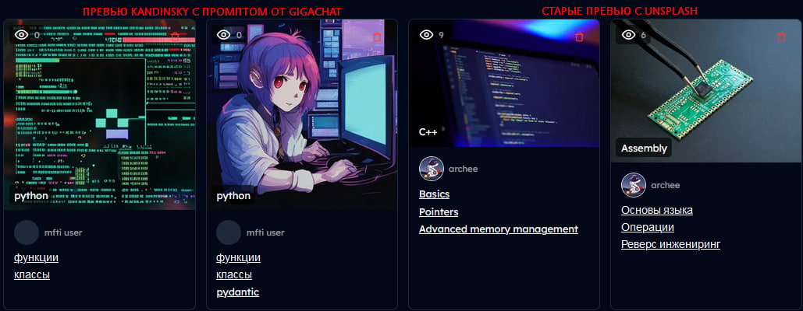
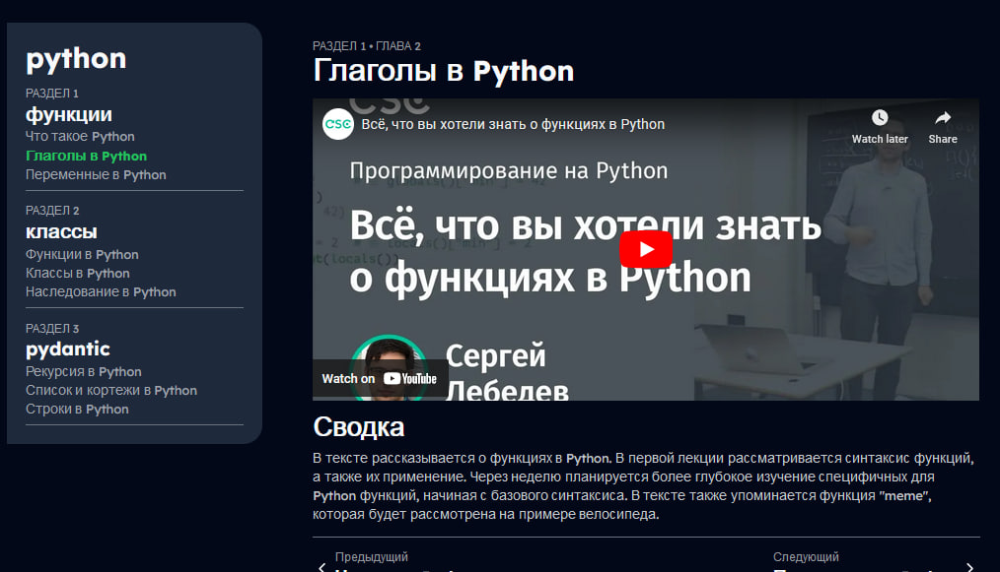

# Youknow
Платформа самостоятельного образования с ИИ
Полностью рабочий билд доступен на https://youknow.academai.ru
В данном репозитории представлен *тестовый* билд с gigachat и kandinsky!

## Описание запуска проекта

### Настройка основного приложения
1. `git clone https://github.com/AcademAI/youknow_mfti` 
2. Заполните`.env` со значениями (пример в .env.example)
3. `npm i`

Далее либо:
`npm run dev`

либо:
`docker build -t youknow_nextjs .`
`docker run --detach --name youknow youknow_nextjs`

### Настройка микросервиса youknow_validations
1. `git clone https://github.com/AcademAI/youknow_validations`
2. Заполните`.env` со значениями (пример в .env.example)
3. `python -m venv venv`
4. `pip install -r requirements.txt`
5. `python main.py`

### Настройка микросервиса ytscraper
1. `git clone https://github.com/AcademAI/ytscraper`
2. Заполните`.env` со значениями (пример в .env.example)
3. `python -m venv venv`
4. `pip install -r requirements.txt`
5. `python app.py`

## Дополнительно

### Что сделали и оно работает:

`Gigachat генерит промпт для Kandinsky по названию курса`

`Gigachat генерит содержание курса и успешно обобщает youtube видео`

### p.s.
На данный момент gigachat следует следующим инструкциям:
1. Создание глав на основе разделов
2. Создание поискового запроса для youtube
3. Создание промпта для Kandinsky
4. Обобщение транскрипта видео

### p.p.s 
Если у вас что - то не работает, пожалуйста убедитесь что:
1. Вы запустили все 3 сервиса локально
2. Вы установили все ключи в .env
3. Если что - пишите @soitends, помогу развернуть